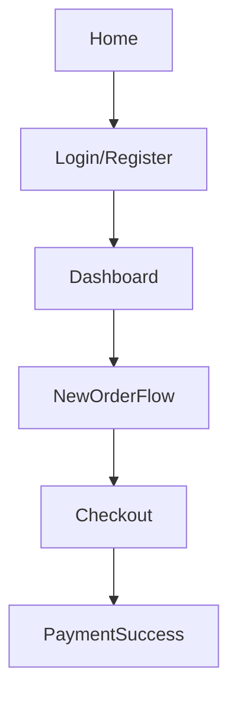

# 🎯 Project Goal

**FashionSmith** empowers users to:

- Create an account
- Input & save measurements
- Place custom tailored orders
- Make payments
- Track delivery status

---

## 🧭 Frontend Structure Overview

### 🖥️ Main Routes

```
/
├── Home           # Hero, services, CTA
├── About          # About FashionSmith
├── Services       # Offerings (shirts, suits, etc.)
├── FAQ            # Common questions
├── Contact        # Form or contact info
├── Login          # User authentication
├── Register       # Signup form
└── Dashboard      # Protected user area
```

### 🔐 Authenticated User Routes (`/dashboard`)

```
/dashboard
├── Overview           # Welcome + shortcuts
├── Profile            # Update name, email, password
├── Measurements
│   ├── View           # Saved measurements
│   └── Add/Edit       # Add or update sizes
├── Orders
│   ├── New Order      # Style > Fabric > Measurements > Checkout
│   └── Order History  # Past orders & status
├── Payment
│   └── Pay Now        # Integrated checkout (Paystack/Flutterwave)
└── Track Order        # Real-time/manual status updates
```

### 🛠️ Admin Panel (`/admin`)

```
/admin
├── Dashboard      # KPIs (orders, users, revenue)
├── Users          # Manage users
├── Orders         # View/update order status
├── Measurements   # View user inputs
├── Notifications  # Send updates (optional)
└── Settings       # Site configs (optional)
```

---

## 🖼️ Suggested UI Flow



---

## 🎨 Design Suggestions

- **Fonts:** Poppins, Inter, Raleway (modern & clean)
- **Colors:**
  - Primary: Rich navy / deep indigo
  - Accent: Gold / Copper
  - Background: #f9f9f9 or white
  - Text: #222 or dark gray

**Hero Slogan:**

> “Tailored to Perfection.”

**CTA Button:**  
`Start Your Order` → `/register`

---

## 📦 Components to Design & Reuse

- **Navbar:** Auth-based links
- **Sidebar:** For dashboard pages
- **ProtectedRoute:** Auth guard
- **MeasurementForm:** Used in order & profile
- **OrderCard:** Order history, admin
- **Stepper:** Order progress (Fabric → Measurement → Payment)
- **Toast:** React-toastify feedback
- **Button, Input, Select:** Reusable UI blocks

---

## 🔄 Optional Enhancements

| Feature       | Value                     |
| ------------- | ------------------------- |
| Dark Mode     | Modern UX                 |
| Animations    | Framer Motion transitions |
| Save Progress | Half-complete orders      |
| Email Updates | Triggered from backend    |

# FashionSmith Frontend Stack Guide

A modern, scalable stack for your client-side app—covering structure, styling, state, forms, icons, payments, and more.

---

## 1. Project Structure

```
client/
├── public/
├── src/
│   ├── assets/        # Images, logos
│   ├── components/    # Reusable UI components
│   ├── pages/         # Home, Orders, Account, etc.
│   ├── hooks/         # Custom hooks (useAuth, useOrders, etc.)
│   ├── context/       # Auth & app state
│   ├── utils/         # Formatting, API helpers
│   ├── api/           # Axios wrapper & API calls
│   ├── App.jsx
│   └── main.jsx
```

---

## 2. Styling

- **Tailwind CSS** (already used)
- **Optional UI Kits:** [DaisyUI](https://daisyui.com/), [Shadcn UI](https://ui.shadcn.com/), [Headless UI](https://headlessui.com/)
  - Ready-made, Tailwind-compatible components (buttons, modals, cards, etc.)

---

## 3. State Management

| Feature             | Tool                       | Why?                                      |
| ------------------- | -------------------------- | ----------------------------------------- |
| Auth & user context | React Context + useReducer | Lightweight, ideal for login/logout state |
| Server state        | React Query                | Caching, refetching, pagination           |
| Global UI state     | Zustand or Context         | Minimal, ergonomic                        |

> **Tip:** Use React Query for all remote data (orders, users, etc.).

---

## 4. Forms & Validation

- **react-hook-form:** Fast, flexible forms
- **zod** or **yup:** Schema validation

```bash
npm install react-hook-form zod
```

```js
import { useForm } from "react-hook-form";
import { zodResolver } from "@hookform/resolvers/zod";
```

---

## 5. Icons

- **Lucide React** (modern, actively maintained)
- Optional: Heroicons, Phosphor Icons

```bash
npm install lucide-react
```

```js
import { ShoppingCart, User, Truck } from "lucide-react";
```

---

## 6. Payment Integration

| Gateway     | React SDK               |
| ----------- | ----------------------- |
| Paystack    | react-paystack          |
| Flutterwave | flutterwave-react-v3    |
| Stripe      | @stripe/react-stripe-js |

---

## 7. Tracking Deliveries

- Backend: Expose `/orders/:id/status`
- Frontend: Poll status via React Query
- Visualize with a stepper component

---

## 8. Date Handling

- **dayjs** or **date-fns** for formatting, timestamps, delivery estimates

```bash
npm install dayjs
# or
npm install date-fns
```

---

## 9. Authentication (HTTP-only cookies)

- Use axios with `withCredentials: true`
- Protect routes via context (e.g., AuthContext)
- Create `PrivateRoute` components

---

## 10. Bonus Tools

| Tool             | Purpose                               |
| ---------------- | ------------------------------------- |
| clsx/classnames  | Dynamically toggle Tailwind classes   |
| react-toastify   | Toast notifications                   |
| framer-motion    | Animations for modals, pages, loaders |
| react-router-dom | SPA routing                           |
| vite             | Fast build tool (already used)        |

---

## Suggested Flow Pages

| Page            | Feature Description                        |
| --------------- | ------------------------------------------ |
| Home            | Showcase brand, redirect to account/signup |
| Account/Profile | Manage info, view measurements             |
| Order Flow      | Form for measurements, fabric options      |
| Orders          | List orders with status, dates             |
| Admin Panel     | Manage users, orders, deliveries           |

---
